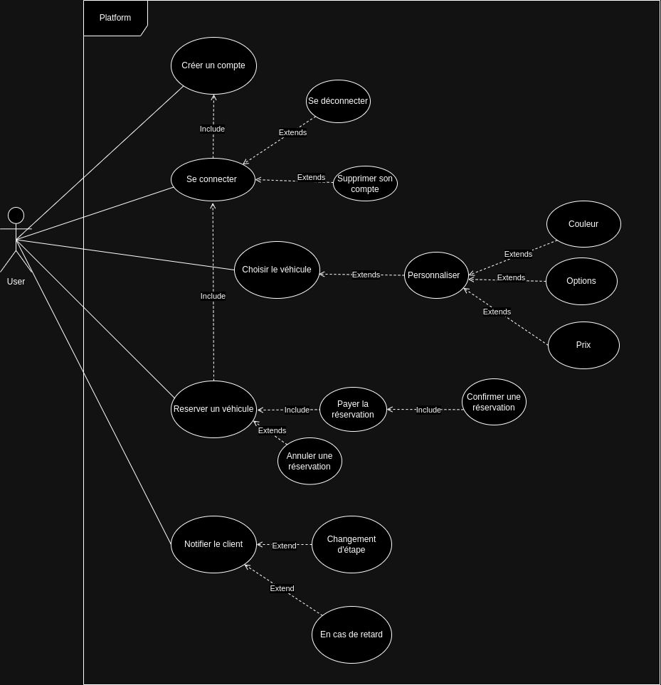

# CDA-Site-achat-et-de-reservation

---

## UML

### **Diagramme de cas d’utilisation**

_L’utilisateur (`User`), va pouvoir créer un compte client, accéder à son compte et le supprimer. Il pourra choisir un modèle et entamer la phase de personnalisation du véhicule qui comprend : le choix de la couleur et les options supplémentaires ajoutées (ou non). Ensuite, il lui f'audra s'authentifier et il pourra réserver le véhicule, payer, et de ce fait, confirmer la réservation. Il lui sera également possible d’annuler la réservation. À cette étape le véhicule sera fabriquer et le client recevra une notification à chaque nouveau statut de la production jusqu’à son acheminement_

**Notre diagramme use case va refléter les actions que peut réaliser l’acteur (ici, `User`) sur la plateforme :**

**L'utilisateur peut :**

- Créer un compte client en ligne
- Se connecter et ainsi se déconnecter ou supprimer son compte
- Choisir un véhicule et le personnaliser (connection non obligatoire)
- Réserver un véhicule et payer ce qui entrainera la confirmation de la réservation. Il pourra aussi annuler la réservation
- Être notifié des changement d'étape et des retards possibles

---

### **Diagramme de classes**

Classe `User`\
Classe `Vehicle`\
Classe `Reservation`\
Classe `Notification`

**Les relations :**\
La classe `User` est lié la classe `Reservation`\
Et la classe `Reservation` est lié à la classe `Notification` et à la classe `Vehicle`

**Attributs dans les différentes classes :**\
`User` : `id`, `firstname`, `lastname`, `password`, `email`\
`Vehicle` : `id`, `model`, `price`, `color`, `costsColor`, `options`, `costsOptions`\
`Reservation` : `id`, `isConfirmed`, `isPaid`, `customerName`, `date`\
`Notification` : `id`, `message`, `date`

---

## DESIGN PATTERNS

### **Factory Method**

**Rôle:** _Ce pattern est utile dans notre contexte pour la création des voitures. En effet, nous avons trois modèles de voitures différents et nous ne voulons pas avoir à modifier le code client en fonction du modèle de voiture choisi_

**Utilité dans le contexte :**

- Le pattern Factory Method est utilisé dans la classe `VehicleFactory`

- Cette classe implémente l'interface `Factory` et possède une méthode `createVehicle()` qui retourne une instance d'un objet Vehicle

- La classe VehicleFactory possède trois méthodes concrètes `createCityCar()`, `createFamilyCar()` et `createSportiveCar()` qui retournent respectivement une instance d'un objet `CityCar`, `FamilyCar` et `SportiveCar`

- Le client utilise la classe `VehicleFactory` pour créer une instance d'un objet `Vehicle` sans avoir à connaître la classe concrète de l'objet

---

**Avantages :**
Il permet de centraliser la logique de création des objets ce qui permet de faciliter l'ajout de nouveaux types d'objets

**Inconvénients :**
...

---

### **Observer**

**Rôle :** _Le pattern Observer permet de définir une dépendance d'un-à-plusieurs entre des objets. Ce pattern est utile dans notre contexte pour gérer les notifications du statut de la commande qui sont envoyées à l'utilisateur. Nous avons donc opté pour ce design patterns comportemental pour la fonctionnalité 'Notification' de la plateforme. En effet, il nous est apparu que l'Observer permet d'établir une relation entre objets, de manière à ce que lorsque l'état d'un objet change, tous les objets dépendants en soient informés et mis à jour automatiquement. Ici, ce pattern permet de notifier le client du statut de sa réservation, c'est-à-dire à quel étape en est sa commande_

---

**Utilité dans le contexte :**

- Le pattern Observer est implémenté par les classes `Subject` et `Observer`

- La classe `Reservation` implémente l'interface `Subject`

- Cette classe possède une méthode `attach()` qui permet d'ajouter un observateur à la liste des observateurs et une méthode `detach()` qui permet de supprimer un observateur de la liste des observateurs

- La classe `Notification` implémente l'interface `Observer`. Cette classe possède une méthode `update()` qui est appelée lorsque le sujet change d'état

- La classe `Reservation` notifie les observateurs lorsqu'une nouvelle notification est disponible

---

**Avantages :**
Le pattern Observer permet de séparer les objets qui envoient des notifications des objets qui reçoivent les notifications. Cela permet de rendre le code plus flexible, plus facile à maintenir et réutilisable

**Inconvénients :**
Le pattern Observer peut rendre le code plus complexe

---

**_CONCLUSION : Nous pensons que notre choix des patterns est pertinent dans le contexte de ce projet car ils permettent de découpler le code, de le rendre plus flexible et plus maintenable. On peut réutiliser le code et faciliter l'ajout de nouvelles fonctionnalités_**
